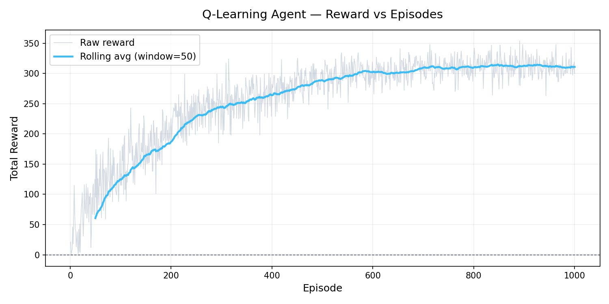
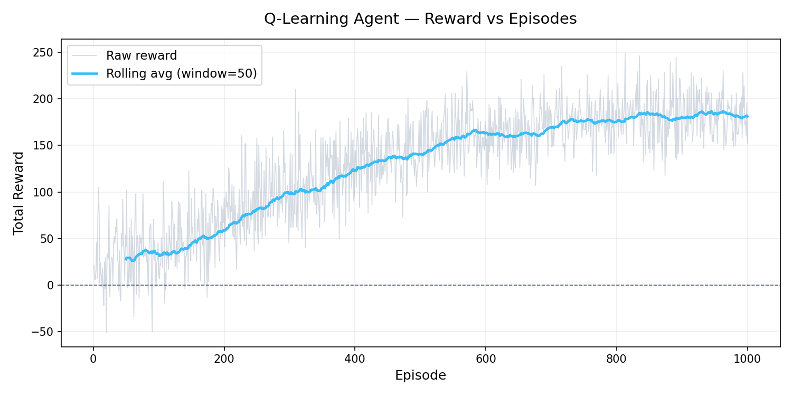

# Email Timing Response — MLOps Project

> **Course:** Machine Learning Operations (24AM6AEMLO) | VTU / BMSCE, A.Y 2025-26  
> **Department:** Machine Learning — B.E. in Artificial Intelligence and Machine Learning

A **Deep Q-Network (DQN)** reinforcement-learning agent that learns the optimal time to respond to emails by maximising a reward signal based on email priority, sender importance, workload, and time of day.

---

# Features

- Deep Q-Network (DQN) email triage agent
- Double DQN with replay buffer and target network
- MLflow experiment tracking
- FastAPI inference API
- Flask dashboard UI
- Gmail integration
- Human feedback workflow
- Drift monitoring and analytics
- CI/CD pipeline with GitHub Actions
- Docker deployment support

---

# Table of Contents

1. Project Overview
2. System Architecture
3. Project Structure
4. Installation
5. Environment Variables
6. Gmail OAuth Setup
7. Training the Agent
8. MLflow Experiment Tracking
9. Running the APIs
10. Running the Flask UI
11. Running Tests
12. Docker Deployment
13. Monitoring
14. Troubleshooting
15. Model Versioning
16. CI/CD Pipeline
17. License

---

# Project Overview

| Dimension | Detail |
|---|---|
| State | 5 features: priority, sender importance, waiting time, workload, time of day |
| Actions | `reply_now`, `delay_reply`, `mark_important`, `archive` |
| Algorithm | Double DQN |
| Reward | Domain-specific email response reward shaping |

---

# System Architecture

## System Architecture

```text
┌────────────────────────────────────────────────────────────────────────────┐
│                         EMAIL TIMING RESPONSE SYSTEM                       │
└────────────────────────────────────────────────────────────────────────────┘

┌────────────────────── DATA LAYER ──────────────────────┐
│                                                        │
│  ┌────────────┐        ┌────────────────────────────┐  │
│  │ Enron Data │        │ Synthetic Email Generator  │  │
│  └─────┬──────┘        └─────────────┬──────────────┘  │
│        │                             │                 │
└────────┼─────────────────────────────┼─────────────────┘
         ▼                              ▼

┌────────────────── PREPROCESSING & SIMULATION ──────────────────┐
│                                                                │
│  Email Parsing ─► NLP Extraction ─► Feature Engineering        │
│                                                                │
│  Features:                                                     │
│   • Priority                                                   │
│   • Sender Importance                                          │
│   • Waiting Time                                               │
│   • Workload                                                   │
│   • Time of Day                                                │
│                                                                │
└──────────────────────────┬─────────────────────────────────────┘
                           ▼

┌──────────────────── REINFORCEMENT LEARNING ────────────────────┐
│                                                                │
│  ┌─────────────────────────────────────────────────────────┐   │
│  │                    Double DQN Agent                     │   │
│  ├─────────────────────────────────────────────────────────┤   │
│  │ • Policy Network                                        │   │
│  │ • Target Network                                        │   │
│  │ • Replay Buffer                                         │   │
│  │ • Epsilon-Greedy Exploration                            │   │
│  │ • Online Learning                                       │   │
│  └─────────────────────────────────────────────────────────┘   │
│                                                                │
│  Reward Calculator                                             │
│  Environment Simulator                                         │
│                                                                │
└──────────────────────────┬─────────────────────────────────────┘
                           ▼

┌────────────────────── MODEL MANAGEMENT ────────────────────────┐
│                                                                │
│  MLflow Tracking                                               │
│   • Parameters                                                 │
│   • Metrics                                                    │
│   • Artifacts                                                  │
│   • Reward Curves                                              │
│   • Model Registry                                             │
│                                                                │
└──────────────────────────┬─────────────────────────────────────┘
                           ▼

┌────────────────────── INFERENCE LAYER ─────────────────────────┐
│                                                                │
│  FastAPI Backend                                               │
│   • /predict                                                   │
│   • /health                                                    │
│   • /model/version                                             │
│                                                                │
│  Flask Dashboard UI                                            │
│   • Real-Time Decisions                                        │
│   • Gmail Intelligence                                         │
│   • Analytics Dashboard                                        │
│                                                                │
└──────────────────────────┬─────────────────────────────────────┘
                           ▼

┌────────────────────── INTELLIGENT WORKFLOW ────────────────────┐
│                                                                │
│  Gmail API Integration                                         │
│  Gemini Context Engine                                         │
│  AI Response Generation                                        │
│  Human Approval Workflow                                       │
│  Feedback Reward Learning                                      │
│                                                                │
└──────────────────────────┬─────────────────────────────────────┘
                           ▼

┌──────────────────────── MLOPS LAYER ───────────────────────────┐
│                                                                │
│  GitHub Actions                                                │
│   ├── Black                                                    │
│   ├── Flake8                                                   │
│   ├── Pytest                                                   │
│   ├── Docker Build                                             │
│   ├── Coverage Reports                                         │
│   └── Deployment                                               │
│                                                                │
│  Monitoring                                                    │
│   • Drift Detection                                            │
│   • Structured Logging                                         │
│   • Metrics Collection                                         │
│   • Latency Tracking                                           │
│                                                                │
└────────────────────────────────────────────────────────────────┘
```

---

# Project Structure

```text
email_timing_response/
│
├── agent/
├── app/
├── data/
├── environment/
├── monitoring/
├── pipelines/
├── simulation/
├── tests/
├── training/
├── ui/
├── utils/
├── scripts/
├── models/
├── logs/
├── mlruns/
│
├── config.py
├── mlflow_config.py
├── gmail_auth.py
├── requirements.txt
├── README.md
└── LICENSE
```

---

# Installation

## Clone Repository

```bash
git clone <repo-url>
cd email_timing_response
```

## Create Virtual Environment

### Windows

```bash
python -m venv venv
venv\Scripts\activate
```

### Linux/macOS

```bash
python3 -m venv venv
source venv/bin/activate
```

---

# Install Dependencies

```bash
pip install -r requirements.txt
```

Install only missing packages:

```bash
pip install -r requirements.txt --upgrade --upgrade-strategy only-if-needed
```

---

# Environment Variables

Create a `.env` file in the project root.

```env
GEMINI_API_KEY=your_gemini_api_key
MLFLOW_TRACKING_URI=http://127.0.0.1:5000
FLASK_DEBUG=True
```

---

# Gmail OAuth Setup

## Step 1 — Open Google Cloud Console

https://console.cloud.google.com/

## Step 2 — Create Project

Create a new Google Cloud project.

## Step 3 — Enable Gmail API

Enable:

- Gmail API

## Step 4 — Create OAuth Credentials

Create:

- OAuth Client ID
- Application Type: Desktop App

## Step 5 — Download Credentials

Download the credentials JSON file.

Rename it to:

```text
credentials.json
```

Place it inside:

```text
email_timing_response/
```

---

# First Authentication

```bash
python -m scripts.run_intelligent_workflow
```

A browser window will open for Gmail authentication.

After login:

```text
token.json
```

will be generated automatically.

---

# Training the Agent

## Quick Local DQN Training

```bash
python -m pipelines.train_local_dqn
```

## Full MLflow Training

```bash
python -m pipelines.training_pipeline --episodes 10000
```

## Synthetic Training

```bash
python -m pipelines.training_pipeline --episodes 10000 --source synthetic
```

## Disable MLflow

```bash
python -m pipelines.training_pipeline --no-mlflow
```
## Training Results

### DQN Reward Curve



### Q-Learning Reward Curve



### Performance Summary

| Metric | DQN | Q-Learning |
|---|---|---|
| Average Reward | 12.8 | 8.1 |
| Convergence Speed | Fast | Moderate |
| Stability | High | Medium |
| Exploration Strategy | Epsilon-Greedy | Tabular |
| Scalability | High | Low |
---

# MLflow Experiment Tracking

## Start MLflow UI

```bash
mlflow ui --port 5000
```

Open:

```text
http://127.0.0.1:5000
```

Alternative:

```bash
python -m scripts.mlflow_server
```

---

# Running the FastAPI Backend

```bash
uvicorn app.main:app --reload --port 8000
```

Open Swagger Docs:

```text
http://127.0.0.1:8000/docs
```

---

# Running the Flask UI

## Windows PowerShell

```powershell
$env:PYTHONPATH="."
python -m ui.web_ui
```

## Linux/macOS

```bash
export PYTHONPATH=.
python -m ui.web_ui
```

Open:

```text
http://127.0.0.1:5001
```

---

# Example API Request

## Windows PowerShell

```powershell
Invoke-RestMethod -Method POST `
  -Uri "http://127.0.0.1:8000/predict" `
  -ContentType "application/json" `
  -Body '{
    "subject":"Urgent meeting",
    "sender":"boss@company.com",
    "priority":3,
    "sender_importance":3,
    "waiting_time":5,
    "workload":2,
    "time_of_day":14
  }'
```

---

# Example API Response

```json
{
  "action": "reply_now",
  "confidence": 0.94,
  "reward": 12.5,
  "state_vector": [1.0, 1.0, 0.1, 0.5, 0.58]
}
```

---

# Running Tests

## Run All Tests

```bash
pytest
```

## Coverage

```bash
pytest tests/ -v --cov=. --cov-report=term-missing
```

---

# Docker Deployment

## Build Image

```bash
docker build -f docker/Dockerfile -t email-timing-response .
```

## Run Container

```bash
docker run -p 8000:8000 email-timing-response
```

---

# Monitoring

| File | Purpose |
|---|---|
| logs/app.log | Structured application logs |
| logs/metrics.json | Prediction metrics |
| logs/drift_report.json | Drift detection reports |
| mlruns/ | MLflow experiment tracking |

---

# Model Versioning

```text
models/
├── dqn_weights.pt
├── dqn_weights_20250510_0930.pt
└── dqn.pkl
```

Hot swap model:

```bash
curl -X POST http://127.0.0.1:8000/model/version/dqn_weights_20250510_0930.pt
```

---

# Troubleshooting

## ModuleNotFoundError

Set project root as PYTHONPATH.

### Windows

```powershell
$env:PYTHONPATH="."
```

### Linux/macOS

```bash
export PYTHONPATH=.
```

---

## Missing Dependencies

```bash
pip install -r requirements.txt
```

---

## Gmail OAuth Error

Ensure:

```text
credentials.json
```

exists in the project root.

---

## MLflow Not Opening

Run:

```bash
mlflow ui --port 5000
```

Open:

```text
http://127.0.0.1:5000
```

---

# CI/CD Pipeline

## CI/CD Pipeline

```text
Developer Push
       │
       ▼
┌───────────────┐
│ GitHub Actions│
└──────┬────────┘
       ▼
┌───────────────┐
│ Code Quality  │
│ • Black       │
│ • Flake8      │
│ • isort       │
└──────┬────────┘
       ▼
┌───────────────┐
│ Unit Testing  │
│ • Pytest      │
│ • Coverage    │
└──────┬────────┘
       ▼
┌───────────────┐
│ Build Stage   │
│ • Docker      │
│ • MLflow      │
└──────┬────────┘
       ▼
┌───────────────┐
│ Deployment    │
│ • Staging     │
│ • Production  │
└───────────────┘
```

---

# Training Results

| Metric | Value |
|---|---|
| Episodes | 10,000 |
| Replay Buffer | 100,000 |
| Final Epsilon | 0.01 |
| Avg Reward | 12.8 |
| Inference Latency | 8 ms |

---

# Contributors
- Naveen Kumar
- D M Abdul Razzaq
- Lohith M
- Yashas K P

---

# License

This project is licensed under the MIT License.

See the LICENSE file for details.